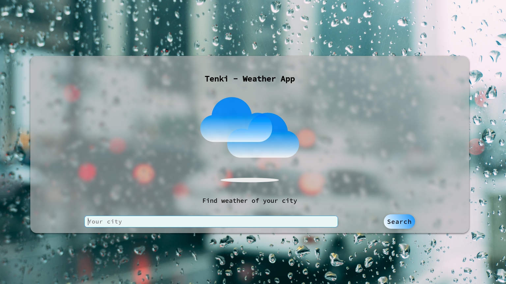
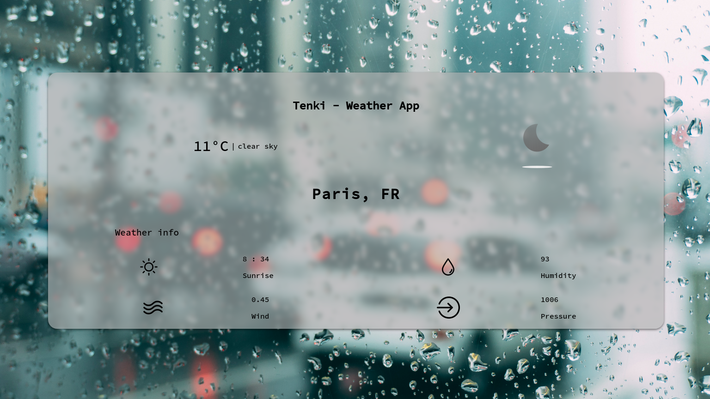

# tenki

Tenki is a weather application, it informs about the weather ~~of a city during a certain number of days~~

## How to use

clone the project and get your api key, @see <https://openweathermap.org/api>

## Example

